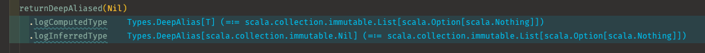
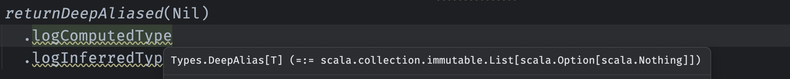

# type logger

Microlibrary for debugging type inference in Scala 3 projects.

## Usage



Type Logger with [Error Lens](https://marketplace.visualstudio.com/items?itemName=usernamehw.errorlens) and [Metals](https://marketplace.visualstudio.com/items?itemName=scalameta.metals) in Visual Studio Code.



Type Logger in IntelliJ IDEA.

Excerpt from [examples.scala](examples.scala):

```scala
def examples: Unit =
  import Types.*
  import typelogger.*

  // Use the `logInferredType` method to log the type that would be inferred for the expression
  logInferredType(10 * 4.2) // scala.Double

  // You can pass a block of code to it...
  logInferredType: // Types.Divergent
    val x = 10
    val a = A(15)
    if x > 5 then a else B("hello")

  // ... or use it as an extension method.
  List(1, 2, 3).logInferredType // scala.collection.immutable.List[scala.Int]

  // If you wnated to see the computed types before the inference you can use the `logComputedType` method instead.
  logComputedType: // Types.A | Types.B
    val x = 10
    val a = A(15)
    if x > 5 then a else B("hello")

  // You can nest the calls to both functions.
  logInferredType: // scala.Char
    first(
      first(List("abc", "def", "ghi")).logComputedType // java.lang.String
    ).logComputedType // scala.Char


  // Both functions can give you simplified and dealiased form o type
  returnDeepAliased(Nil)
    .logComputedType // Types.DeepAlias[T] (=:= scala.collection.immutable.List[scala.Option[scala.Nothing]])
    .logInferredType // Types.DeepAlias[scala.collection.immutable.Nil] (=:= scala.collection.immutable.List[scala.Option[scala.Nothing]])

  // `logComputedType` can also show how the type is widened
  val x = new Instance
  logComputedType(x) // x <:< Types.Instance
  logComputedType(x.inner) // x.inner <:< x.Inner (=:= scala.Int)

end examples
```

## Q&A

- **What is the minimum required Scala version?**

  Type Logger works with Scala 3.2.0 and newer.

- **Does it have any impact on performance?**

  It doesn't have any impact on the performance of the compiled code. All the logging is done during the typer phase of the compilation and the methods are not leaving any footprint in later phases and in the compilation output.

  Frequent usage of those methods can have a small but non-zero impact on compilation time.
